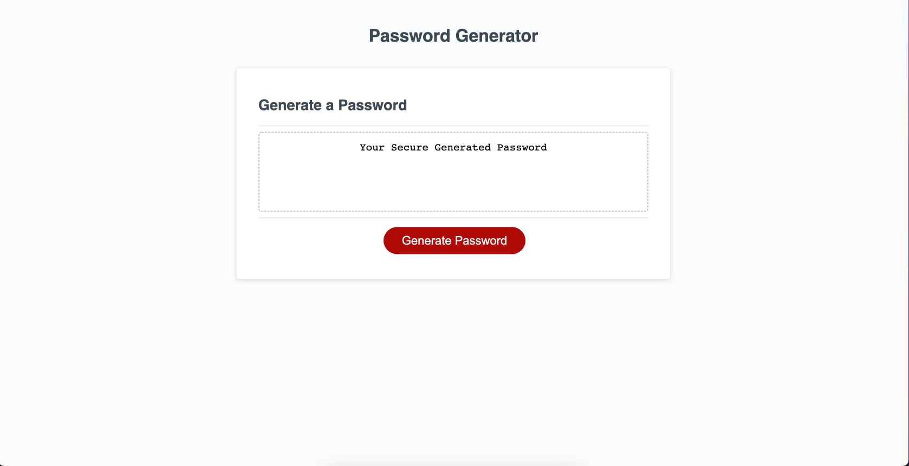

# Module-3-Password-Generator
[deployed link](https://chasek6.github.io/Module-3-Password-Generator/)
Random Password Generator

Table of Contents
- Description
- ScreenShot of Random Password Generator
- Link
- Credit 

Description 
The Module 3 challenge was to create a Random Password Generator using Script.js file.

The goal of creating a Random Password Generator was to learn and apply Javascript methods, functions,for loops, prompts, events and alerts.

I was successfully able to deploy a Random Password Generator webpage that would take 128 characters & generate a random password based off: how many characters the user wants and rather or not the user wants uppercase or lowercase letter as well as special characters and numbers.

Credits 

Link Used for Reference:
https://developer.mozilla.org/en-US/docs/Web/JavaScript/Reference/Global_Objects/Array/concat
https://www.w3schools.com/java/ref_string_concat.asp

Link to Deployed Application [deployed link](https://chasek6.github.io/Module-3-Password-Generator/)
